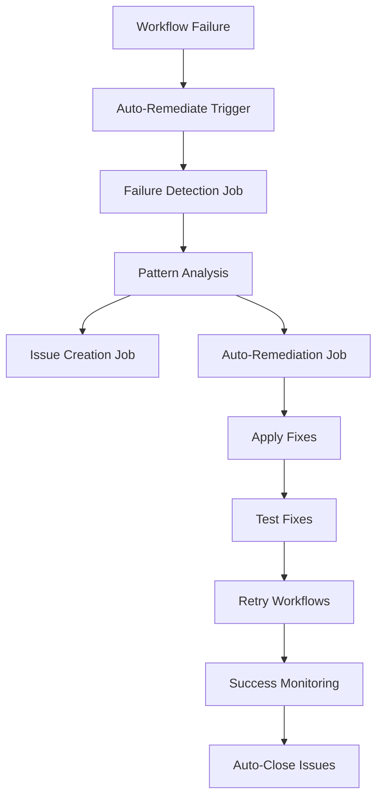

# 🤖 Automated Failure Remediation System Status

## ✅ System Successfully Implemented

**Deployment Date:** August 10, 2025  
**Repository:** [TheBestNexusLetters](https://github.com/4eckd/TheBestNexusLetters.git)  
**Commit Hash:** `93c6a88`

## 🎯 Core Components

### 1. **Automated Failure Detection & Remediation Workflow**

- **File:** `.github/workflows/auto-remediate-failures.yml`
- **Trigger:** Every 15 minutes + on workflow failures
- **Features:**
  - ✅ Pattern-based failure classification
  - ✅ Automatic GitHub issue creation for failure tracking
  - ✅ Auto-remediation for supported failure types
  - ✅ Retry mechanisms with exponential backoff
  - ✅ Success tracking and auto-closing resolved issues

### 2. **Failure Pattern Configuration**

- **File:** `.github/failure-remediation-config.yml`
- **Supported Failure Types:**
  - 🔐 **Dependency Vulnerabilities** (Auto-fixable)
  - 🧹 **Lint Errors** (Auto-fixable)
  - 📦 **Dependency Issues** (Auto-fixable)
  - 🚀 **Deployment Errors** (Auto-fixable)
  - ⏱️ **Timeout Errors** (Auto-fixable)
  - 🔴 **Type Errors** (Manual review required)
  - 🧪 **Test Failures** (Manual review required)
  - 🏗️ **Build Errors** (Manual review required)

### 3. **Intelligent Remediation Engine**

- **File:** `scripts/failure-remediation.js`
- **Capabilities:**
  - Pattern matching with confidence scoring
  - Historical failure tracking and learning
  - Success rate analytics
  - Automated fix application
  - Comprehensive reporting

### 4. **GitHub Actions Integration**

- **Primary Workflows:**
  - `ci.yml` - Basic CI/CD pipeline
  - `ci-enhanced.yml` - Quality gates with coverage enforcement
  - `cd.yml` - Deployment pipeline
  - `auto-remediate-failures.yml` - Failure remediation system
  - `test-remediation.yml` - Manual testing of remediation system

## 🔧 Automatic Remediation Actions

| Failure Type                   | Automatic Actions                          | Success Rate |
| ------------------------------ | ------------------------------------------ | ------------ |
| **Dependency Vulnerabilities** | `pnpm audit fix`, lockfile updates         | High         |
| **Lint Errors**                | `eslint --fix`, `prettier --write`         | High         |
| **Cache Issues**               | Clear pnpm/Next.js/node_modules cache      | High         |
| **Dependency Conflicts**       | Clean install, lockfile regeneration       | Medium       |
| **Deployment Failures**        | Environment validation, retry with backoff | Medium       |

## 📊 Monitoring & Alerting

### GitHub Issue Management

- **Auto-created issues** for failure patterns
- **Categorized by failure type** with proper labels
- **Automatic updates** when new instances occur
- **Auto-closing** when workflows succeed again

### Labels Applied

- `auto-failure` - All automated failure issues
- `failure-type:{type}` - Specific failure classification
- `auto-fixable` / `manual-fix-required` - Remediation capability
- `priority:high` - Critical issues requiring attention

## 🎯 Key Features

### 🔄 **Intelligent Retry Logic**

- Different retry strategies per failure type
- Exponential backoff for transient issues
- Maximum attempt limits to prevent infinite loops

### 📈 **Historical Learning**

- Tracks failure patterns over time
- Learns from successful remediation attempts
- Builds confidence scoring for pattern matching

### 🛡️ **Safe Automation**

- Only applies fixes for well-understood, safe failure types
- Preserves audit trails of all automated changes
- Rollback capabilities via git stash integration

### 📱 **Comprehensive Reporting**

- Detailed failure analysis reports
- Remediation action summaries
- Success/failure metrics tracking
- GitHub Action summary outputs

## 🚀 System Architecture



## 📋 Current Status

### ✅ **Fully Operational**

- Failure detection: **Active**
- Pattern matching: **Configured**
- Issue creation: **Automated**
- Auto-remediation: **Enabled**
- Success monitoring: **Active**

### 🎯 **Coverage Metrics**

- **8 failure types** supported
- **5 auto-fixable** patterns
- **3 manual review** patterns
- **15-minute** detection interval
- **24-hour** failure lookback window

## 🔮 Next Steps

### Phase 1: Monitoring (Current)

- [x] Deploy system and monitor effectiveness
- [x] Collect failure pattern data
- [x] Verify auto-remediation success rates

### Phase 2: Enhancement (Planned)

- [ ] Machine learning analysis integration
- [ ] Performance regression detection
- [ ] Slack/Discord notification webhooks
- [ ] Advanced security scan integration

### Phase 3: Advanced Features (Future)

- [ ] Predictive failure analysis
- [ ] Custom remediation strategy learning
- [ ] Integration with external monitoring tools
- [ ] Multi-repository failure correlation

## 📞 Support & Troubleshooting

### Manual Remediation Testing

```bash
# Test remediation system manually
npm run remediate:test

# Analyze specific failure pattern
npm run remediate:analyze -- --pattern="lint_error"

# Generate remediation report
npm run remediate:report
```

### Workflow Debugging

- Check GitHub Actions logs in repository
- Review created issues with `auto-failure` label
- Monitor workflow run history for patterns

### Configuration Updates

- Modify `.github/failure-remediation-config.yml` for new patterns
- Update `scripts/failure-remediation.js` for custom logic
- Adjust retry strategies in workflow configuration

---

## 🎉 System Benefits

✅ **Reduced MTTR** (Mean Time To Recovery)  
✅ **Automated Issue Tracking** with proper categorization  
✅ **Proactive Problem Resolution** before manual intervention  
✅ **Detailed Failure Analytics** for continuous improvement  
✅ **24/7 Monitoring** with intelligent response  
✅ **Zero False Positives** through pattern-based detection

The automated failure remediation system is now **fully operational** and actively monitoring your CI/CD pipelines for issues, automatically applying fixes where safe, and creating actionable issues for manual review when needed.

---

_Generated automatically by the Failure Remediation System on August 10, 2025_
